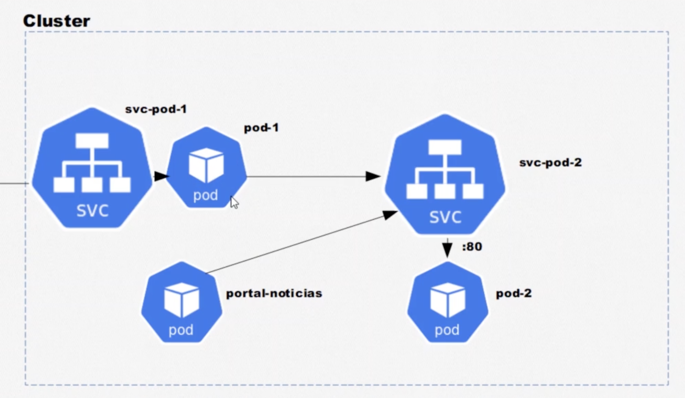

# Criando e entendendo pods

## Imperativa: 

`> kubectl run nome-do-pod --image=nginx:latest`

`> kubectl get pods || kubectl get pods -o wide`

`> kubectl describe pod nome-do-pod`

`> kubectl edit pod nome-do-pod`

`> kubectl delete pod nome-do-pod || kubectl delete -f primeiro-pod.yaml`

`> kubectl delete pods --all`

`> kubectl delete svc --all`

`> kubectl exec -it nome-do-pod -- bash`

## Declarativa: 

> cat \>  primeiro-pod.yaml

```yaml
apiVersion: v1
kind: Pod
metadata: 
 name: primeiro-pod-declarativo
spec: 
  containers:
    -name: nginx-container
    image: nginx:latest
```

`> kubectl apply -f primeiro-pod.yaml`

-- Para validar o arquivo yaml (https://github.com/instrumenta/kubeval)

# Expondo pods com services (svc) 

1. Abstrações para expor applicações executando um ou mais pods
2. Proveem IP's fixos para comunicação
3. Proveem um DNS para um ou mais pods
4. São capazes de fazer balanceamento de carga

## **Existem três tipos de serviço: ClusterIP, NodePort e LoadBalancer**

### 1. **ClusterIP**: Fornece apenas comunicação interna do cluster. 

Exemplo:
Vamos criar dois pods (pod-1 e pod-2) e vamos criar um service para o pod-2 
através de labels

> cat \> portal-noticias.yaml

```yaml
apiVersion: v1
kind: Pod
metadata:
  name: portal-noticias
  labels:
    app: portal-noticias
spec:
  containers:
    - name: container-portal-noticias
      image: nginx:latest
      ports:
        - containerPort: 80
```

> cat \> pod-1.yaml

```yaml
apiVersion: v1
kind: Pod
metadata:
  name: pod-1
spec:
  containers:
    - name: container-pod-1
      image: nginx:latest
      ports:
        - containerPort: 80
```

> cat \> pod-2.yaml
```yaml
apiVersion: v1
kind: Pod
metadata:
  name: pod-2
spec:
  containers:
    - name: container-pod-2
      image: nginx:latest
      ports:
        - containerPort: 80
```

> cat \> svc-pod-2.yaml

```yaml
apiVersion: v1
kind: Service
metadata:
  name: svc-pod-2
spec:
  type: ClusterIP
  selector: 
    app: segundo-pod
  ports: 
    - port: 80  # Porta em que o service está ouvindo
    targetPort: 80 # Onde vai ser dispachado.
```

`> kubectl apply -f pod-1.yaml`

`> kubectl apply -f pod-2.yaml`

`> kubectl apply -f svc-pod-2.yaml`

`> kubectl get svc` 

`> kubectl get pods`

`> kubectl exec -it pod-1 -- bash`

`> curl <ip do svc-pod-2>:80`

**Perguntas:** 
1. E se eu tiver dois pods que possui a label para dar match com o selector do service? <br/>
R: Parece que ele faz um Load balancing decidindo entre um dos dois pods. 

2. E se eu derrubar o pod que está ouvindo o que eu acontece? <br/>
R: O service continua ativo, mas da erro de conexão por ninguém estar ouvindo.

### NodePort

Abre a comunicação do nó com o mundo externo e também funcionam como ClusterIP.



> cat \> svc-pod-1.yaml

```yaml
apiVersion: v1
kind: Service
metadata: 
  name: svc-pod-1

spec:
  type: NodePort 
  ports:
    - port: 80  
    # Como definimos apenas o port, ele define automaticamente
    # o targer port para 80;
    nodePort: 3000 #between 30000-32767
  selector:
    app: primeiro-pod
```

> cat \> pod-1.yaml 

```yaml
apiVersion: v1
kind: Pod
metadata:
  name: pod-1
  labels:
    app: primeiro-pod # inclui a label para ser selecionado.
spec:
  containers:
    - name: container-pod-1
      image: nginx:latest
      ports:
        - containerPort: 80
```

`> kubectl apply -f svc-pod-1.yaml`

`> kubectl apply -f portal-noticias.yaml`

`> kubectl apply -f pod-1.yaml`

`> kubectl get svc`

`> kubectl exec -it portal-noticias -- bash`

`> curl <ip do node port/svc-pod-1>:80`


### Load Balancer 

Mesma funcionalidade que o NodePort, mas também faz balanceamento de carga e ele se integra com o cloud provider (Ex: AWS, Azure, Google Cloud..)

> cat \> svc-pod-1-loadbalancer.yaml

```yaml
apiVersion: v1
kind: Service
metadata:
  name: svc-pod-1-loadbalancer
spec:
  type: Loadbalancer
  ports:
    - port: 80
      nodePort: 3000
  selector:
    app: primeiro-pod
```


