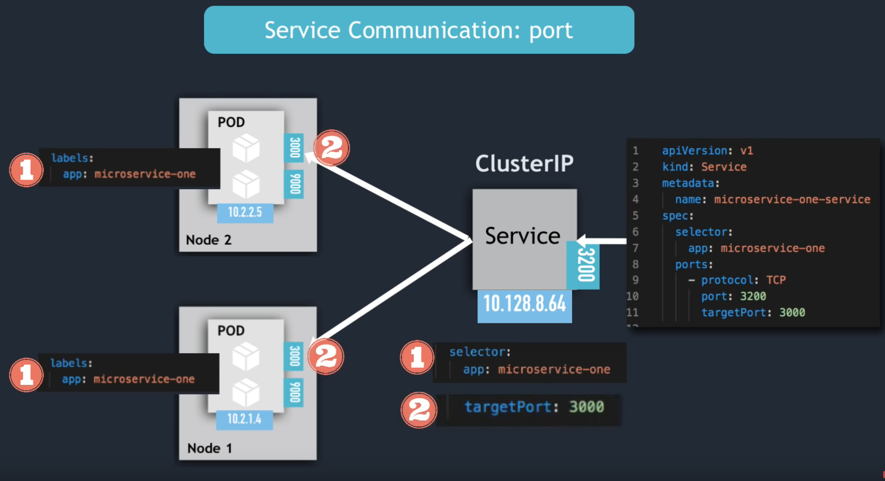

# Arquitetura Kubernetes

# DEVELOP

#FEATURE1


## Nodes ou Worker Nodes: 
- Cada node possui multiplos Pods
- 3 processos devem ser instalados em cada node. 
  - Container runtime.
  - kubelet (Faz iteração com o container e o node)
  - kube proxy *(https://kubernetes.io/docs/reference/command-line-tools-reference/kube-proxy/, tl;dr ele tem uma inteligencia de proxy e um exemplo disso é eviar sobrecargar de rede, mantendo comunicação entre pods do mesmo nó)*
- Nós de trabalho fazem o trabalho real.

## Master Node  
4 processos são executados em cada nó master:
  
### Api Server (Cluster gateway)
Através dele recebe commandos e querys, autenticação e outros processos.

 

### Scheduler
tl;dr 

Tem a inteligencia de ver entre os nós onde criar o pod.

 

### Controller Manager 
tl;dr

Detecta mudanças de estado, quando um pod morre, ele tenta recuperar o stado do cluster o mais rapido possivel e para isso ele faz uma requisição para o scheduler para subir novamente um pod no lugar.

### etcd
tl;dr

É uma loja de chave e valor do estado do cluster *(O cerebro)*, toda a mudança de estado de um *pod* por exemplo é armazenado/atualizado no etcd.

Graças a ele o scheduler sabe onde colocar um *pod*, o controller manager detecta alterações de estado e queries feitas pela api server.

> Em caso de multiplos nós master, api server é balanceado e o etcd é distribuido entre eles.

### Minikube


Para testar localmente é necessário no linux utilizar minikube, assim você pode criar um cluster com nó master e worker. 

### kubectl
 É um cliente de linha de comando no qual podemos enviar comandos e queries para Api Server, exemplos:


`> kubectl apply -f file.yaml`

`> kubectl delete -f file.yaml`

`> kubectl describe pod nome-do-pod`

## Declarativa: 

> cat \>  primeiro-pod.yaml

```yaml
apiVersion: v1
kind: Pod
metadata: 
 name: primeiro-pod-declarativo
spec: 
  containers:
    -name: nginx-container
    image: nginx:latest
```

`> kubectl apply -f primeiro-pod.yaml`

-- Para validar o arquivo yaml (https://github.com/instrumenta/kubeval)

# Expondo pods com services (svc) 

1. Abstrações para expor applicações executando um ou mais pods
2. Proveem IP's fixos para comunicação
3. Proveem um DNS para um ou mais pods
4. São capazes de fazer balanceamento de carga
5. Logo o ciclo de vida de um service não está ligado com o container ou pod não estão ligados.

*Imagens de exemplo*




## **Existem três tipos de serviço: ClusterIP, NodePort e LoadBalancer**

### **ClusterIP**: Fornece apenas comunicação interna do cluster. 

Exemplo:
Vamos criar dois pods (pod-1 e pod-2) e vamos criar um service para o pod-2 
através de labels

> cat \> portal-noticias.yaml

```yaml
apiVersion: v1
kind: Pod
metadata:
  name: portal-noticias
  labels:
    app: portal-noticias
spec:
  containers:
    - name: container-portal-noticias
      image: nginx:latest
      ports:
        - containerPort: 80
```

> cat \> pod-1.yaml

```yaml
apiVersion: v1
kind: Pod
metadata:
  name: pod-1
spec:
  containers:
    - name: container-pod-1
      image: nginx:latest
      ports:
        - containerPort: 80
```

> cat \> pod-2.yaml

```yaml
apiVersion: v1
kind: Pod
metadata:
  name: pod-2
spec:
  containers:
    - name: container-pod-2
      image: nginx:latest
      ports:
        - containerPort: 80
```

> cat \> svc-pod-2.yaml

```yaml
apiVersion: v1
kind: Service
metadata:
  name: svc-pod-2
spec:
  type: ClusterIP
  selector: 
    app: segundo-pod
  ports: 
    - port: 80  # Porta em que o service está ouvindo
    targetPort: 80 # Onde vai ser dispachado.
```

`> kubectl apply -f pod-1.yaml`

`> kubectl apply -f pod-2.yaml`

`> kubectl apply -f svc-pod-2.yaml`

`> kubectl get svc` 

`> kubectl get pods`

`> kubectl exec -it pod-1 -- bash`

`> curl <ip do svc-pod-2>:80`

**Perguntas:** 
1. E se eu tiver dois pods que possui a label para dar match com o selector do service? <br/>
R: Parece que ele faz um Load balancing decidindo entre um dos dois pods. 

2. E se eu derrubar o pod que está ouvindo o que eu acontece? <br/>
R: O service continua ativo, mas da erro de conexão por ninguém estar ouvindo.

#### Headless services

Funciona como um DNS Lookup retornando o ip do POD

Casos de uso, muito comum em StateFul Applications como banco de dados: 

- Client quer fazer comunicação com um POD especifico diretamente
- POD quer fazer comunicação com um POD especifico diretamente
- Não pode ser randomicamente selecionado

Exemplo:

```yaml
apiVersion: v1
kind: Service
metadata:
  name: mongodb-service-headless
spec:
  clusterIP: None
  selector:
    app: mongodb
  ports:
    - protocol: TCP
      port: 27017
      targetPort: 27017
```


### NodePort

Abre a comunicação do nó com o mundo externo e também funcionam como ClusterIP.

Não são seguros por abrir uma comunicação direta com sua aplicação no pod.

 

 

> cat \> svc-pod-1.yaml

```yaml
apiVersion: v1
kind: Service
metadata: 
  name: svc-pod-1
spec:
  type: NodePort 
  ports:
    - port: 80  
    # Como definimos apenas o port, ele define automaticamente
    # o targer port para 80;
    nodePort: 3000 #between 30000-32767
  selector:
    app: primeiro-pod
```

> cat \> pod-1.yaml 

```yaml
apiVersion: v1
kind: Pod
metadata:
  name: pod-1
  labels:
    app: primeiro-pod # inclui a label para ser selecionado.
spec:
  containers:
    - name: container-pod-1
      image: nginx:latest
      ports:
        - containerPort: 80
```

`> kubectl apply -f svc-pod-1.yaml`

`> kubectl apply -f portal-noticias.yaml`

`> kubectl apply -f pod-1.yaml`

`> kubectl get svc`

`> kubectl exec -it portal-noticias -- bash`

`> curl <ip do node port/svc-pod-1>:80`

### Load Balancer 

Mesma funcionalidade que o NodePort, mas também faz balanceamento de carga e ele se integra com o cloud provider (Ex: AWS, Azure, Google Cloud..)

 

 Quando criamos um Loadbalancer ele já faz o trabalho de criar um ClusterIP e NodePort:

 - Loadbalancer service é uma extensão do NodePort
 - NodePort service é uma extensão do ClusterIP 

 

> cat \> svc-pod-1-loadbalancer.yaml

```yaml
apiVersion: v1
kind: Service
metadata:
  name: svc-pod-1-loadbalancer
spec:
  type: Loadbalancer
  ports:
    - port: 80
      nodePort: 3000
  selector:
    app: primeiro-pod
```

## ConfigMap e Environment Variables

Exemplo de variavéis de ambiente direto no arquivo yaml: 

> cat \> exemplo.yaml

```yaml
apiVersion: v1
kind: Pod
metadata:
  name: db-pod
  labels:
    app: db-pod
spec:
  containers:
    -name: db-pod-container
    image: enderecoregistry/mysql-db:1
    ports:
      - containerPort: 3306
    env:
      - name: "MYSQL_ROOT_PASSWORD"
      value: "exemplo"
      - name: "MYSQL_DATABASE"
      value: "exemplo"
      - name: "MYSQL_PASSWORD"
      value: "exemplo"
```

### Configurando ConfigMaps && Secrets

Um pod pode ter um ou mais config maps, os config maps podem ser reutilizado entre os pods.

docs: https://kubernetes.io/docs/tasks/configure-pod-container/configure-pod-configmap/

Você também tem um componente chamado secret, para dados que não podem ser armazenados em plain text.

Exemplo de ConfigMap: 

> cat \> db-configmap.yaml

```yaml
apiVersion: v1
kind: ConfigMap
metadata:
  name: db-configmap
data:
   MYSQL_ROOT_PASSWORD: "exemplo"
   MYSQL_DATABASE: "exemplo"
   MYSQL_PASSWORD: "exemplo"
```


> cat \> app-configmap.yaml

```yaml
apiVersion: v1
kind: ConfigMap
metadata:
  name: app-configmap
data:
  HOST_DB: "exemplo"
  USER_DB: "root"
  PASS_DB: "exemplo"
```

> cat \> exemplo.yaml

```yaml
apiVersion: v1
kind: Pod
metadata:
  name: db-pod
  labels:
    app: db-pod
spec:
  containers:
    -name: db-pod-container
    image: enderecoregistry/mysql-db:1
    ports:
      - containerPort: 3306
    # Modo uma a uma:
    #env:
      # - name: "MYSQL_ROOT_PASSWORD"
      # valueFrom: 
      #   configMapKeyRef:
      #     name: db-configmap
      #     key: MYSQL_ROOT_PASSWORD
      # - name: "MYSQL_DATABASE"
      # valueFrom: 
      #   configMapKeyRef:
      #     name: db-configmap
      #     key: MYSQL_DATABASE

      #Todas de uma vez:
      envFrom:
        - configMapRef:
          name: db-configmap
        - configMapRef:
          name: app-configmap
```

> Todos os exemplos até aqui estão na pasta "basico"

## ReplicaSets e Deployments

 

### ReplicaSet

Caso um pod falhe, por ser efemero, como criar outro para assumir o lugar de maneira automatica? 

Para isso utilizamos o **Replica Set**, ele é uma estrutura que pode encapsular um ou mais pods. Logo um desses pods podem falhar e o replica set vai criar um novo automaticamente.

### Deployment

É uma camada acima do replica set, quando definimos um Deployment também definimos um replica set. 

> *Observação: Podemos utilizar o seguinte comando para nos auxiliar em criar arquivos declarativos:*

` > kubectl create deployment name --image=image [--dry-run] [options] `

` > kubectl create deployment nginx-deployment --image=nginx `

` > kubectl get deployment nginx-deployment -o yaml > nginx-deployment.yaml `

Exemplo: 
> cat \> nginx-deployment.yaml

```yaml
apiVersion: apps/v1
kind: Deployment
metadata:
  name: nginx-deployment
spec:
  replicas: 3
  template:
    metadata:
      name: nginx-pod
      labels:
        app: nginx-pod
    spec:
      containers:
        - name: nginx-container
          image: nginx:stable
          ports:
            - containerPort: 80
  selector:
    matchLabels:
      app: nginx-pod
```

`> kubectl apply -f nginx-deployment.yaml`

`> kubectl get rs`

`> kubectl get deployments`

### History/Versionamento do deployment

Com o deployment ganhamos um histórico e versionamento das versões, exemplo:

1. Executar a alteração e gravar no histórico:

`> kubectl apply -f nome-deployment.yaml` --record

2. Para criar um comentário sobre a causa de alteração

`> kubectl annotate deployment <nome do deployment> kubernetes.io/change-cause="<Comentário sobre a causa da mudança>"`

3. Comando para listar:

`> kubectl rollout history deployment <nome do deployment>`

Com isso podemos fazer um *"rollback"* de versões, chamando de **undo** 

`> kubectl rollout undo deployment <nome do deployment> --to-revision=<identificador da revisão>`

## Persistindo dados com volumes (vol, pv, pvc sc)

docs: https://kubernetes.io/docs/concepts/storage/volumes/
microsoft docs: https://docs.microsoft.com/pt-br/azure/aks/concepts-storage#volumes
video explicação aprofundada e cases: youtube.com/watch?v=0swOh5C3OVM

### volumes

Volumes possuem ciclos de vida independente dos containers, porém são dependentes do pod.

Exemplo: Um pod com dois containers, se um container falhar o pod ainda está vivo, logo o volume ainda resiste, já se os dois containers falharem, o pod vai ser destruido e o volume junto com ele.

Possuimos várias integrações de volumes:

- awsElasticBlockStore
- azureDisk
- azureFile
- cephfs
- cinder
- configMap
- downwardAPI
- emptyDir
- fc (fibre channel)
- flocker (deprecated)
- gcePersistentDisk
- gitRepo (deprecated)
- glusterfs
- hostPath
- iscsi
- local
- nfs
- persistentVolumeClaim
- portworxVolume
- projected
- quobyte
- rbd
- scaleIO (deprecated)
- secret
- storageOS
- vsphereVolume

Exemplo com hostPath, criando um pod com dois containers compartilhando um mesmo volume com binding para a maquina do host. 

> cat \> pod-volume.yaml

```yaml
apiVersion: v1
kind: Pod
metadata:
  name: pod-volume
spec:
  containers:
    - name: nginx-container
      image: nginx:latest
      volumeMounts:
        - mountPath: /volume-dentro-do-container
          name: primeiro-volume
    - name: jenkins-container
      image: jenkins:alpine
      volumeMounts:
        - mountPath: /volume-dentro-do-container
          name: primeiro-volume
  volumes:
    - name: primeiro-volume
      hostPath:
        path: <algum diretorio do seu computador>
        type: DirectoryOrCreate
```

*Observação: Nesse caso, caso seja deletado o pod, o volume também será excluido, porem, os arquivos que estão na maquina do host não.*

### Persistent Volume and Persistent Volume Claim (pv, pvc) 

O volume separa o armazenamento do recipiente. Seu ciclo de vida é acoplado a um pod. Ele permite reinicializações seguras de contêineres e compartilhamento de dados entre contêineres em um pod.

O **Persistent Volume** separa o armazenamento do pod. Seu ciclo de vida é independente. Ele permite reinicializações seguras de pods e compartilhamento de dados entre eles.

**PVC** é uma declaração de necessidade de armazenamento que pode em algum momento tornar-se disponível - como em vinculado a alguns reais PV.

É um pouco como o conceito de programação assíncrona de um promessa ou uma interface. PVC promete que em algum momento"traduza" para o volume de armazenamento que seu aplicativo poderá usar e uma das características definidas como classe, tamanho e modo de acesso.


E para que todas essas abstrações? 

Desacoplamento da aplicação com a infraestrutura e posso separar os papeis responsaveis de administrador da infre e devops, um faz a claim e o administrador (especialista) cria a estrutura do volume.

Exemplo:

1. Pod com a necessidade de um storage/volume linkado ao um pvc.

> cat \> pod-pv.yaml

``` yaml
apiVersion: v1
kind: Pod
metadata:
  name: pod-pv
spec:
  containers:
    - name: nginx-container
      image: nginx:latest
      volumeMounts:
        - mountPath: /volume-dentro-do-container
          name: primeiro-pv
  volumes:
    - name: primeiro-pv
      persistentVolumeClaim:
        claimName: pvc-1
```

2. PVC declarando um *"contrato como se fosse uma interface"*

> cat \> pvc.yaml

``` yaml
apiVersion: v1
kind: PersistentVolumeClaim
metadata:
  name: pvc-1
spec:
  accessModes:
    - ReadWriteOnce
  resources:
    requests:
      storage: 10Gi
  storageClassName: standard
```

3. PV declarado para atender o pvc e linkado ao um disco criado na google cloud

> cat \> pv.yaml

```yaml
apiVersion: v1
kind: PersistentVolume
metadata:
  name: pv-1
spec:
  capacity:
    storage: 10Gi
  accessModes:
    - ReadWriteOnce
  gcePersistentDisk:
    pdName: pv-disk # nome do disco na google cloud
  storageClassName: standard
```

4. Aplicando:

`> kubectl apply -f pv.yaml` 

`> kubectl apply -f pvc.yaml` 

`> kubectl apply -f pod-pv.yaml` 

5. Assim temos um pod utilizando como volume um disco da google cloud.

### Utilizando Storage Classes

Storage classes são utilizados pelo pvc para criar um disco e um pv dinamicamente.

> cat \> sc.yaml

```yaml
apiVersion: storage.k8s.io/v1
kind: StorageClass
metadata:
  name: slow
provisioner: kubernetes.io/gce-pd
parameters:
  type: pd-standard
  fstype: ext4
  replication-type: none
```

> cat \> pvc-sc.yaml

```yaml
apiVersion: v1
kind: PersistentVolumeClaim
metadata:
  name: pvc-sc
spec:
  accessModes:
    - ReadWriteOnce
  resources:
    requests:
      storage: 10Gi
  storageClassName: slow #linkando com o storage class criado.
```

> cat \> pod-sc.yaml

```yaml 
apiVersion: v1
kind: Pod
metadata:
  name: pod-sc
spec:
  containers:
    - name: nginx-container
      image: nginx:latest
      volumeMounts:
        - mountPath: /volume-dentro-do-container
          name: primeiro-pv
  volumes:
    - name: primeiro-pv
      persistentVolumeClaim:
        claimName: pvc-sc
```

`> kubectl apply -f sc.yaml`

`> kubectl apply -f pvc-sc.yaml`

`> kubectl apply -f pod-sc.yaml`

### StateFul Set

Funciona de forma bem semelhante ao um deployment, mas o conteudo não será perdido ao pod ser recriado. Cada *POD* irá ter um *PVC* e *PV*. 

Caso um *POD* falhe, um novo será recriado com uma mesma identificação e ele se ligara ao mesmo *PVC* e *PV* do anterior.

Exemplo: Ao criar um *StatefulSet* com containers utilizando o volume de um *PVC*, com um storage class do StateFul Set será criado um *PV* default *hostpath*. 

**Observação: Deployment são para aplicações sem estado, já StateFul set são para aplicações como bancos de dados**

Aplicações de banco de dados por exemplo tem maiores dificuldades do que uma api em suas replicas, por exemplo: 

- Não podem ser criadas ao mesmo tempo
- Não podem ser endereçadas randomicamente
- As replicas de pod não são identicas - Pod Identity


** Pod Identity **

- Uma identidade para cada POD.
- Criado pela mesma especificação, mas não substituível. 
- Identificador persistente em qualquer reprogramação.

Quando escalamos horizontalmente o MySql, temos banco master (escrita/leitura) e os slaves apenas leitura, esses bancos precisam ser criados ou deletados em ordem e um banco só pode ser clonado a partir do anteirior está pronto e eles precisam sempre estar sincronizados. Caso um pod de banco morra, uma nova replica será criada e anexada na persistencia do antigo pod. 

> cat \> statefulset.yaml

```yaml
apiVersion: apps/v1
kind: StatefulSet
metadata:
  name: statefulset-exemplo
spec: 
  replica: 1
  template:
    metadata:
      labels:
        app: stateful-app
      name: stateful-app-nome
    spec:
      containers:
        - name: stateful-app-container
          image: nginx:latest
          ports:
            - containerPort: 80
          envFrom:
            - configMapRef:
                name: stateful-configmap
          volumeMounts:
            - name: volume-exemplo
              mountPath: /var/www/html/uploads
      volumes:
        - name: volume-exemplo
          persistentVolumeClaim:
            claimName: pvc-statefulset
  selector:
    matchLabels:
      app: stateful-app
  serviceName: svc-statefulset-exemplo
```

`> kubectl apply -f statefulset.yaml`

## Probes

Sua principal utilização é mostrar para o Kubernetes a saude da aplicação dentro do pod. 

### Liveness Probes

Periodicamente ele vai chegar a saude da aplicação (httpResponseCode entre 200 a 400 é saudavel)

> cat \> sfs-liveness-probe.yaml

```yaml
apiVersion: apps/v1
kind: StatefulSet
metadata:
  name: statefulset-exemplo
spec: 
  replica: 1
  template:
    metadata:
      labels:
        app: stateful-app
      name: stateful-app-nome
    spec:
      containers:
        - name: stateful-app-container
          image: nginx:latest
          ports:
            - containerPort: 80
          envFrom:
            - configMapRef:
                name: stateful-configmap
          livenessProbe:
            httpGet:
              path: /healthcheck
              port: 80
            periodSeconds: 10
            failureThreshold: 3
            initialDelaySeconds: 20
          volumeMounts:
            - name: volume-exemplo
              mountPath: /var/www/html/uploads
      volumes:
        - name: volume-exemplo
          persistentVolumeClaim:
            claimName: pvc-statefulset
  selector:
    matchLabels:
      app: stateful-app
  serviceName: svc-statefulset-exemplo
```

### Readiness Probes

Garantir que o container do pod está pronto para receber requisições.

> cat \> sfs-readness-probe.yaml

```yaml
apiVersion: apps/v1
kind: StatefulSet
metadata:
  name: statefulset-exemplo
spec: 
  replica: 1
  template:
    metadata:
      labels:
        app: stateful-app
      name: stateful-app-nome
    spec:
      containers:
        - name: stateful-app-container
          image: nginx:latest
          ports:
            - containerPort: 80
          envFrom:
            - configMapRef:
                name: stateful-configmap
          livenessProbe:
            httpGet:
              path: /healthcheck
              port: 80
            periodSeconds: 10
            failureThreshold: 3
            initialDelaySeconds: 20
          ## HERE
          readinessProbe:
            httpGet:
              path: /healthcheck-readiness
              port: 80
            periodSeconds: 10
            failureThreshold: 3
            initialDelaySeconds: 20
          ###
          volumeMounts:
            - name: volume-exemplo
              mountPath: /var/www/html/uploads
      volumes:
        - name: volume-exemplo
          persistentVolumeClaim:
            claimName: pvc-statefulset
  selector:
    matchLabels:
      app: stateful-app
  serviceName: svc-statefulset-exemplo
```

## Horizontal Pod Auto Scaller (hpa)

Componente que por base de metricas consigo escalar os pods.

> cat \> statefulset-exemplo.yaml

```yaml
apiVersion: apps/v1
kind: StatefulSet
metadata:
  name: statefulset-exemplo
spec: 
  replica: 1
  template:
    metadata:
      labels:
        app: stateful-app
      name: stateful-app-nome
    spec:
      containers:
        - name: stateful-app-container
          image: nginx:latest
          ports:
            - containerPort: 80
          envFrom:
            - configMapRef:
                name: stateful-configmap
          livenessProbe:
            httpGet:
              path: /healthcheck
              port: 80
            periodSeconds: 10
            failureThreshold: 3
            initialDelaySeconds: 20
          readinessProbe:
            httpGet:
              path: /healthcheck-readiness
              port: 80
            periodSeconds: 10
            failureThreshold: 3
            initialDelaySeconds: 20
         ## HERE
          resources:
            requests:
              cpu: 10m
          volumeMounts:
            - name: volume-exemplo
              mountPath: /var/www/html/uploads
      volumes:
        - name: volume-exemplo
          persistentVolumeClaim:
            claimName: pvc-statefulset
  selector:
    matchLabels:
      app: stateful-app
  serviceName: svc-statefulset-exemplo
```

> cat \> autoscalling-hpa.yaml

```yaml
apiVersion: autoscalling/v2beta2
kind: HorizontalPodAutoscaler
metadata:
  name: statefulset-hpa
spec:
 # Aqui vem as informações de quem eu quero escalar
  scaleTargetRef:
    apiVersion: apps/v1
    kind: StatefulSet 
    name: statefulset-exemplo
  minReplicas: 1
  maxReplicas: 10
  metrics:
    - type: Resource
      resource:
        name: cpu
        target:
          type: utilization
          averageUtilization: 50
```

`> kubectl apply -f statefulset-exemplo.yaml`

`> kubectl apply -f autoscalling-hpa.yaml`

> Todos os exemplos até aqui estão na pasta intermediario.

# EKS - Comming soon


